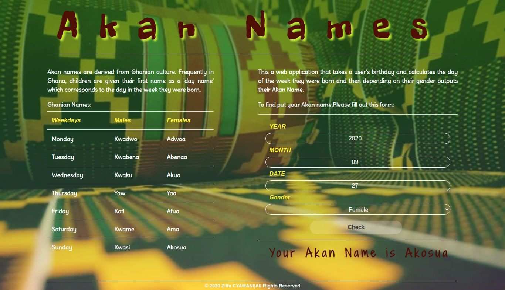

# Akan - Names
## Description
 A web application that takes a user's birthday and calculates the day of the week they were born and then depending on their gender outputs their Akan Name. 
Akan names are derived from Ghanian culture. Frequently in Ghana, children are given their first name as a 'day name' which corresponds to the day in the week they were born. Here are Ghanian day names.
## Author(s) information
[iamzilfa](https://github.com/iamzilfa)

## Setup/Installation Requirements

* Github acoount
* Git
* Install ubuntu
* Visual code studio

## BDD
* A user enter year of birth
* A user enter month of birth
* A user enter date of the month 

## Technologies Used
* HTML5
* CSS3
* JAVASCRIPT
* MARKDOWN
* BOOTSTRAP
## Support and contact details
If anyone need support concerning my project or anything related, just reach out to zilcyam@gmail.com
 
[Here is the link](https://iamzilfa.github.io/AkanName/ "Akan-Name")

### License

Copyright (c) [2020] [Zilfa Cyamani]

Permission is hereby granted, free of charge, to any person obtaining a copy
of this software and associated documentation files (the "Software"), to deal
in the Software without restriction, including without limitation the rights
to use, copy, modify, merge, publish, distribute, sublicense, and/or sell
copies of the Software, and to permit persons to whom the Software is
furnished to do so, subject to the following conditions:

The above copyright notice and this permission notice shall be included in all
copies or substantial portions of the Software.

THE SOFTWARE IS PROVIDED "AS IS", WITHOUT WARRANTY OF ANY KIND, EXPRESS OR
IMPLIED, INCLUDING BUT NOT LIMITED TO THE WARRANTIES OF MERCHANTABILITY,
FITNESS FOR A PARTICULAR PURPOSE AND NONINFRINGEMENT. IN NO EVENT SHALL THE
AUTHORS OR COPYRIGHT HOLDERS BE LIABLE FOR ANY CLAIM, DAMAGES OR OTHER
LIABILITY, WHETHER IN AN ACTION OF CONTRACT, TORT OR OTHERWISE, ARISING FROM,
OUT OF OR IN CONNECTION WITH THE SOFTWARE OR THE USE OR OTHER DEALINGS IN THE
SOFTWARE.