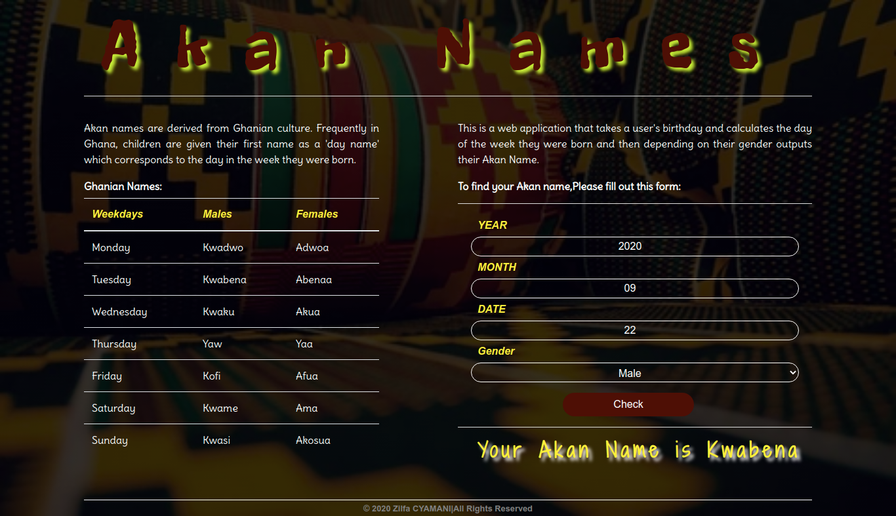

# Akan - Names
## Description
 A web application that takes a user's birthday and calculates the day of the week they were born and then depending on their gender outputs their Akan Name. 
Akan names are derived from Ghanian culture. Frequently in Ghana, children are given their first name as a 'day name' which corresponds to the day in the week they were born. Here are Ghanian day names.
## Author(s) information
[iamzilfa](https://github.com/iamzilfa)

## Setup/Installation Requirements

* Github acoount
* Git
* Install ubuntu
* Visual code studio

## BDD
* A user enter year of birth
* A user enter month of birth
* A user enter date of the month 

## Technologies Used
* HTML5
* CSS3
* JAVASCRIPT
* MARKDOWN
* BOOTSTRAP
## Support and contact details
If anyone need support concerning my project or anything related, just reach out to zilcyam@gmail.com
 
[Here is the link](https://iamzilfa.github.io/AkanName/ "Akan-Name")

<!--  -->

### License

Copyright (c) [2020] **Z.C**

